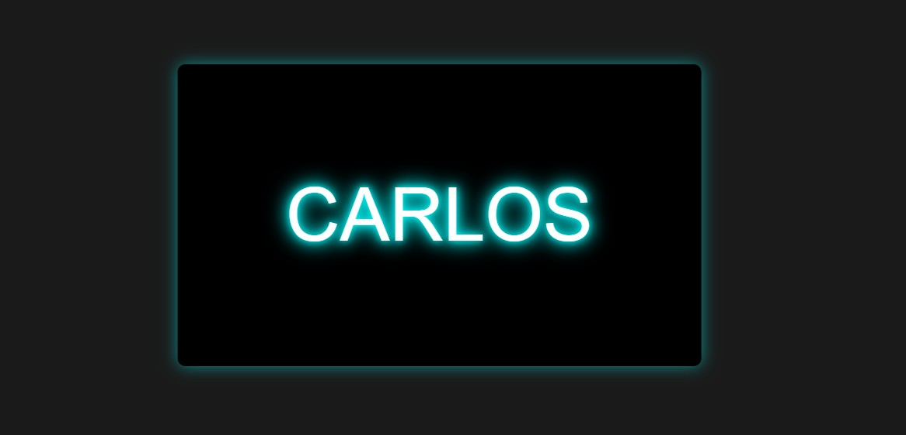

# Proyecto: Ventana Emergente con Efecto Neon

## Descripción General
Este proyecto consiste en una página web interactiva donde el usuario puede ingresar un nombre en un campo de texto. Al hacer clic en el botón "Mostrar" o presionar la tecla **Enter**, el nombre aparece en una ventana emergente con un efecto neon animado. La ventana solo se puede cerrar presionando la tecla **Escape**.

---

## Características Principales
1. **Campo de Entrada y Botón**  
   - Input para ingresar texto con estilo oscuro y bordes verdes.
   - Botón interactivo con efecto hover.

2. **Ventana Emergente**  
   - Diseño centrado con fondo negro y animación neon alrededor del texto.
   - El texto cambia de color automáticamente cada 3 segundos (rosa, cian, amarillo y verde).

3. **Cierre con Teclado**  
   - La ventana se cierra exclusivamente con la tecla **Escape**.

4. **Diseño Responsive**  
   - Ajuste automático al tamaño de la pantalla.

